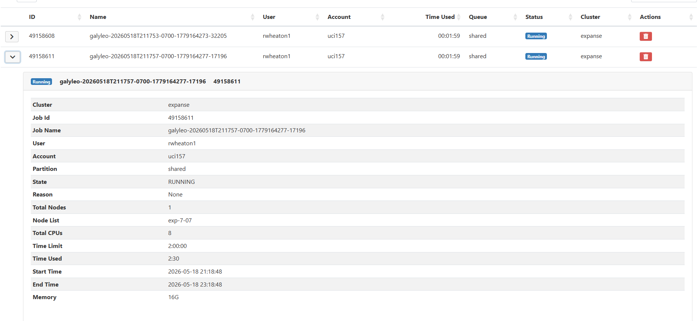
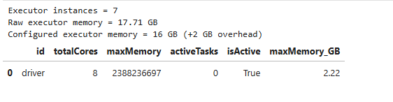

# ragus-wheaton-iribe-232


### Abstract
We have selected the musicbrainz.db dataset, a community-maintained, open source encyclopedia of music information with over 60GB of native SQL data in Postgres with well-defined schema. The tables include data for artists, genres, instruments, labels, mediums, releases, recordings, etc. Our core interest is to explore the relationships within this data and how they shape listener taste preferences. Model 1 will utilize the K-Nearest Neighbors approach on meta vectors which defines exactly how related two songs are based on their “DNA” (instruments, genres, labels, etc). Exploring how this model establishes these groups will give a solid foundation for our primary interest in Model 2, which aims to build a recommendation system that produces a k-length list of recommended releases for a given listener ID. To support this, a partner dataset called "ListenBrainz" contains extensive listener metadata that can be combined with the MusicBrainz data. Given the complexity of this problem and the volume of measurable relationships between variables in the MusicBrainz data, a neural network approach, likely a Two-Tower MLP or GNN, will probably be warranted. In the case of issues connecting the ListenBrainz data, we may opt to synthesize the listener data, which will make for another interesting challenge.

[Data download here](https://metabrainz.org/datasets/postgres-dumps#musicbrainz)

### [Here is a link to a Google Doc for us to answer the questions](https://docs.google.com/document/d/1YYfNmefEvFqc3lSUBDbE2O1X1JLKW98UQk25Ylc8ffE/edit?tab=t.akt9gyi2flke)

***

# Milestone 2

### 2: SDSC Expanse Environment Setup

8 total cores and 128 GB total memory, reserving 2 GB for the Spark driver. Executor instances = 8 - 1 = 7. Executor memory = (128 - 2) / 7 = 18 GB per executor. Spark is configured with 7 executor instances and 18 GB executor memory.

Calculated executer memory is ~17.7GB but we reduced it to 16 GB and allocated 2 GB memory overhead per executor to prevent memory exhaustion during heavy operations.


### 3: Data Exploration

The MusicBrainz dataset has a lot of IDs and relationship table columns so we need to sift through it and figure out which numeric columns should be summarized like a continuous variable verses an ID. The loop reports nulls, distinct counts, duplicates, categorical frequencies, numeric summaries, and foreign key uniqueness depending on the column type.

We started by idetifying the primary keys, global ID, forgein key, date part, boolean, text descriptor and count measure clumns for each of the tables we chose.

We then created the function get_column_role that classifies a given column's role/data type. This function is executed in the for loop which loops through each table's columns to summarize them based on their role which was assigned in the get_column_role function.

ID (or id-ish) columns like id, gid, entity0, and entity1, the loop returns missing values, distinct counts, and if foreign keys match the referenced table (not sure if this is actually working how we want it to so take this part with a grain of salt). 

Categorical columns are summarized using value counts and percentages to show which values are most common and whether the distribution is balanced or skewed

Numeric/count columns are summarized with count, mean, standard deviation, min, quartiles, and max

High-cardinality text columns, like names or UUIDs, get summarized with distinct counts and length stats instead of value counts bc there are way too many unique values


### 4: Data Plots

We created the following data plots to explore our dataset and see what trends we could identify as we plan to build our two models.

The first chart was a pie chart that showed the distribution of artists by gender in the dataset. In this pie chart, we see that a majority(approximately 76.5%) of artists are male while the second largest group is female(approximately 23%). Overall we can see that our data skews heavily to one gender.

The second chart was a bar chart that displays the distribution of instrument types used by artists. The chart shows that the most common instrument type is 2 followed by 1 and 3. These type values represent numeric identifiers, which could be further joined with the instrument_type table to obtain more descriptive labels for each category.

The third chart was a horizontal bar chart that focused on the most used music genre tags when music is released. The chart shows that broader music genres like electronic and rock are more common while specific genres like pop rock, indie rock, and alternative rock were some of the least used tags. This suggests that broader genre labels are used more often versus specialized classifications.

The fourth chart was a horizontal bar chart that tracked the number of artists a recording label had. We cut it to the top 15 recording labels per artist count and found that there are a few labels that dominate like the Audio Network and Fruits de Mer Records.

The fifth chart was a histogram that looked at how many artists were credited in each artist credit. The results showed that there are many single artists and very few collaborations.

The last chart was a horizontal bar chart that used the area and artist tables to identify what countries were the most common in the dataset. We found that a majority of the artists are from the United States while countries like Germany and Japan had a high amount of artists as well.


### 5: Preprocessing Plan

Our first milestone will be to build a K-Nearest Neighbors which groups music based on its "DNA" (instruments, genres, labels, etc), so the first step will be to determine precisely which variables constitute part of music's DNA, and determining their relative importance. The next step will be to strip away unnecessary information, such as columns and tables we won't need (for example: "description" in the instruments table, since it contains natural language, will not be helpful for this problem).

The data has a high volume of nulls. Depending on the data type these will need to be dealt with differently - for example, date columns might be left as nulls because imputing an "average" date probably doesn't make any sense. "Type" columns (which indicate something else for each table, but can refer to things like release type: original, bootleg, reissue, etc) have their most common entry set to 1, so nulls in that variable will likely be set to 1. There are also lots of entries in which most data is null - since the dataset is so large, some sets of rows might be filtered out completely.

***

# Milestone 3

### 1. Complete Preprocessing using Spark

 See ```musicbrainz_v3.ipynb``` code.

### 2. Training Our First Distributed Model

 See ```musicbrainz_v3.ipynb``` code.

### 3. Fitting Analysis

We created two Random Forest models with different hyperparameters to evaluate how model complexity affected performance. Our first model used the following parameters:

- Trees = 50
- Max Depth = 10
- Max Bins = 128

This model achieved an F1 score of approximately 0.36 on the test dataset.

Our second model increased the maximum tree depth while keeping the other parameters constant:

- Trees = 50
- Max Depth = 15
- Max Bins = 128

This model achieved a slightly improved F1 score of approximately 0.38.

The improvement from increasing tree depth suggests that the original model was underfitting the data, since deeper trees were able to capture more complex relationships between the metadata and tag based features. Both models still appear to fall on the underfitting side of the fitting curve despite the improved performance. This is due to the noisy genre labels, sparse high-dimensional tag vectors, and the broad variability present in the MusicBrainz dataset whiah all contribute to the difficulty of this task.

We also experimented with additional Random Forest configurations using larger numbers of trees and greater depths. These configurations became computationally expensive because of the scale of the dataset and the size of the generated feature vectors.

The second Random Forest model performed best because the increased tree depth allowed the model to learn more detailed decision boundaries and better capture interactions between categorical metadata and tag derived features.

For Milestone 4, we plan to explore dimensionality reduction techniques such as PCA and SVD. Since the CountVectorizer step produces large sparse feature vectors, reducing dimensionality may help decrease computational cost while preserving important semantic structure within the tags. We also plan to explore clustering approaches such as K-Means in order to identify latent groupings between genres, artists, or releases that may not be captured directly through supervised classification. In addition, we may experiment with other distributed models such as Gradient Boosted Trees or XGBoost to evaluate whether boosting methods can better model the complex nonlinear relationships present in the data.

### 4. Conclusion

Our first model demonstrated that Random Forest classifiers can learn meaningful patterns from the MusicBrainz dataset and perform multiclass genre prediction at scale. The model achieved moderate performance, with an F1 score of approximately 0.38 across the 19 genre categories. While this indicates that the model was able to capture relationships between artist metadata, labels, geographic information, and tags, the task itself was challenging due to noisy and highly variable genre labels derived from user generated tags.

We experimented with adjusting hyperparameters, like number of trees and tree depth, in order to improve performance. However, increasing model complexity significantly increased computational cost and runtime because of the large scale of the dataset. A possible direction for improvement could be additional feature engineering and feature selection. Some tables in MusicBrainz contain rich numerical relationship data, while others contain sparse or noisy text metadata, so refining which features to include could improve performance without dramatically increasing computational requirements. Additional improvements could also come from improved genre normalization, balancing underrepresented genres, or experimenting with more advanced distributed models like Gradient Boosted Trees or XGBoost.

Distributed computing was essential for this task because the dataset contained millions of rows and high dimensional feature vectors generated from release tags. Spark allowed us to distribute preprocessing, joins, aggregations, and model training across multiple executors rather than relying on a single machine. Distributed preprocessing techniques like CountVectorizer, StringIndexer, and VectorAssembler enabled us to efficiently transform large categorical and text-based datasets into feature vectors suitable for machine learning. Without distributed computing, processing and training on a dataset of this scale would have been nearly impossible.

### Executor Summary




### Stage Metrics

